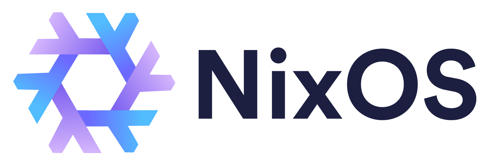

## Welcome to My NixOS & Home-Manager Dotfiles

Hey there, I'm John Carter, and this is where I keep my NixOS and Home-Manager configuration. If you're into this stuff, you might find something interesting here.

#### What's Inside?

These are my personal dotfiles – plain and simple. You'll find configurations for NixOS and Home-Manager, and a section with Nix-Darwin with a connected Home-Manager Module.

#### Why NixOS & Home-Manager?

I like NixOS and Home-Manager because they offer a neat way to manage my system configuration and software. It keeps things tidy and reproducible.

#### Why Nix-Darwin?

Same as 'Why NixOS'? Reproducibility is the buzz word of choice for the nix community. It nice to be able to set up a new work MacBook and have the only throttle be my internet connection speed. Everything else is just waiting to be installed.

#### Feel Free to Borrow!

You're welcome to take a look around and borrow anything you find useful. That's how most of us build our own configurations, right?

#### Got Any Tips & Tricks?

So, take your time, have a look, and if you find something that helps you on your NixOS journey, that's awesome.

Cheers,
John Carter Gonzalez
